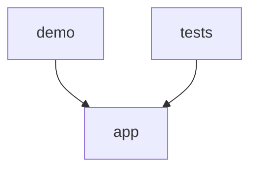

# Code Graph Review — backend

**Generated by:** code_graph_review.py
**Root:** C:\Users\baner\CopyFolder\IoT_thoughts\python-projects\kaggle_experiments\claude_projects\s2p-copilot\backend

## Summary

| Metric | Value |
|--------|-------|
| Total modules | 56 |
| Source modules | 39 |
| Test modules | 17 |
| Total lines | 7,611 |
| Source lines | 5,846 |
| Test lines | 1,765 |
| Classes | 47 |
| Top-level functions | 197 |
| External dependencies | 25 |
| Circular dependencies | 0 |
| Dead export candidates | 89 |

## Module Inventory

| Module | Lines | Classes | Functions | Internal Imports | External |
|--------|-------|---------|-----------|-----------------|----------|
| app\__init__.py | 0 | 0 | 0 | 0 | 0 |
| app\db\__init__.py | 1 | 0 | 0 | 0 | 0 |
| app\db\neo4j.py | 357 | 1 | 0 | 0 | 5 |
| app\domains\__init__.py | 0 | 0 | 0 | 0 | 0 |
| app\domains\s2p\__init__.py | 0 | 0 | 0 | 0 | 0 |
| app\domains\s2p\config.py | 233 | 2 | 0 | 0 | 2 |
| app\domains\s2p\factors.py | 137 | 7 | 1 | 0 | 3 |
| app\domains\s2p\graph.py | 109 | 0 | 3 | 0 | 3 |
| app\domains\s2p\scorer.py | 139 | 0 | 7 | 2 | 2 |
| app\framework\__init__.py | 15 | 0 | 0 | 0 | 0 |
| app\framework\agent.py | 374 | 2 | 0 | 0 | 3 |
| app\framework\audit.py | 277 | 0 | 8 | 2 | 3 |
| app\framework\checkpoint.py | 164 | 1 | 0 | 0 | 6 |
| app\framework\composite_gate.py | 195 | 1 | 0 | 1 | 4 |
| app\framework\convergence_math.py | 45 | 0 | 2 | 0 | 1 |
| app\framework\decision_history.py | 66 | 1 | 0 | 0 | 3 |
| app\framework\economics.py | 90 | 1 | 0 | 0 | 1 |
| app\framework\event_bus.py | 119 | 4 | 0 | 0 | 4 |
| app\framework\feedback_base.py | 172 | 0 | 4 | 1 | 4 |
| app\framework\feedback_store.py | 14 | 0 | 0 | 0 | 1 |
| app\framework\iks_base.py | 120 | 0 | 4 | 0 | 4 |
| app\framework\intervention_controls.py | 362 | 1 | 0 | 1 | 6 |
| app\framework\learning_state.py | 166 | 0 | 4 | 1 | 9 |
| app\framework\narrative_base.py | 127 | 1 | 4 | 0 | 4 |
| app\framework\ols_status.py | 120 | 0 | 1 | 0 | 2 |
| app\framework\provenance.py | 354 | 3 | 6 | 0 | 4 |
| app\framework\shadow_mode.py | 118 | 1 | 0 | 0 | 3 |
| app\framework\similar_cases_base.py | 177 | 1 | 0 | 0 | 6 |
| app\main.py | 14 | 0 | 1 | 3 | 1 |
| app\routers\__init__.py | 0 | 0 | 0 | 0 | 0 |
| app\routers\framework_router.py | 777 | 8 | 1 | 13 | 4 |
| app\routers\s2p.py | 241 | 4 | 4 | 6 | 3 |
| app\routers\s2p_preview.py | 232 | 0 | 18 | 2 | 7 |
| app\services\__init__.py | 0 | 0 | 0 | 0 | 0 |
| app\services\ols_status.py | 7 | 0 | 0 | 1 | 0 |
| app\services\s2p_learning_gate.py | 126 | 1 | 1 | 0 | 3 |
| app\services\synthetic_invoices.py | 185 | 3 | 0 | 1 | 4 |
| demo\__init__.py | 0 | 0 | 0 | 0 | 0 |
| demo\s2p_demo.py | 213 | 0 | 1 | 3 | 2 |
| tests\__init__.py (test) | 0 | 0 | 0 | 0 | 0 |
| tests\test_domain_isolation.py (test) | 292 | 4 | 0 | 2 | 6 |
| tests\test_framework_discipline.py (test) | 93 | 0 | 3 | 2 | 5 |
| tests\test_s2p_config.py (test) | 51 | 0 | 5 | 1 | 2 |
| tests\test_s2p_demo.py (test) | 46 | 0 | 4 | 2 | 3 |
| tests\test_s2p_domain_config.py (test) | 159 | 0 | 15 | 1 | 4 |
| tests\test_s2p_factors.py (test) | 78 | 0 | 7 | 2 | 2 |
| tests\test_s2p_graph.py (test) | 76 | 0 | 5 | 3 | 4 |
| tests\test_s2p_iks.py (test) | 42 | 0 | 4 | 2 | 3 |
| tests\test_s2p_learning_gate.py (test) | 81 | 0 | 7 | 2 | 3 |
| tests\test_s2p_outcome.py (test) | 56 | 0 | 5 | 1 | 3 |
| tests\test_s2p_preview.py (test) | 213 | 0 | 26 | 3 | 3 |
| tests\test_s2p_score_endpoint.py (test) | 55 | 0 | 5 | 1 | 3 |
| tests\test_s2p_scorer.py (test) | 61 | 0 | 6 | 2 | 3 |
| tests\test_s2p_worked_example.py (test) | 190 | 0 | 6 | 3 | 6 |
| tests\test_scaffold.py (test) | 39 | 0 | 3 | 2 | 5 |
| tests\test_synthetic_invoices.py (test) | 233 | 0 | 26 | 2 | 7 |

## Class & Function Index

### app\db\neo4j.py
- **class** `Neo4jClient` (line 14)

### app\domains\s2p\config.py
- **class** `S2PDomainConfig` (line 51)
- **class** `S2PDomainConfigV2` (line 145)

### app\domains\s2p\factors.py
- **class** `S2PEvent` (line 14)
- **class** `SpendCategoryMatchFactor` (line 33)
- **class** `SupplierRiskScoreFactor` (line 48)
- **class** `ContractComplianceFactor` (line 59)
- **class** `SpendAnomalyFactor` (line 75)
- **class** `PatternHistoryFactor` (line 91)
- **class** `VendorTrustFactor` (line 105)
- **def** `compute_factor_vector` (line 131)

### app\domains\s2p\graph.py
- **def** `write_s2p_decision` (line 12)
- **def** `write_s2p_outcome` (line 65)
- **def** `get_s2p_decision` (line 98)

### app\domains\s2p\scorer.py
- **def** `get_scorer` (line 23)
- **def** `reset_scorer` (line 32)
- **def** `_build_scorer` (line 39)
- **def** `update_scorer` (line 55)
- **def** `get_s2p_iks` (line 85)
- **def** `_interpret_iks` (line 114)
- **def** `score_event` (line 125)

### app\framework\agent.py
- **class** `DecisionResult` (line 16)
- **class** `SOCAgent` (line 32)

### app\framework\audit.py
- **def** `_entry_to_dict` (line 67)
- **def** `record_decision` (line 90)
- **def** `record_outcome` (line 124)
- **def** `get_decisions` (line 148)
- **def** `reconstruct_from_memory` (line 157)
- **def** `reset_audit_state` (line 209)
- **def** `record_reset_marker` (line 216)
- **def** `verify_chain` (line 237)

### app\framework\checkpoint.py
- **class** `CheckpointService` (line 23)

### app\framework\composite_gate.py
- **class** `CompositeDiscriminant` (line 30)

### app\framework\convergence_math.py
- **def** `predict_n_half` (line 20)
- **def** `decisions_to_days` (line 39)

### app\framework\decision_history.py
- **class** `DecisionHistoryService` (line 18)

### app\framework\economics.py
- **class** `FrozenROICalculator` (line 4)

### app\framework\event_bus.py
- **class** `DecisionMade` (line 24)
- **class** `OutcomeVerified` (line 38)
- **class** `GraphMutated` (line 52)
- **class** `EventBus` (line 70)

### app\framework\feedback_base.py
- **def** `update_trust` (line 41)
- **def** `get_trust_status` (line 95)
- **def** `get_all_trust_scores` (line 115)
- **def** `get_reward_summary` (line 147)

### app\framework\iks_base.py
- **def** `_mean_centroid_drift` (line 34)
- **def** `compute_iks` (line 57)
- **def** `interpret` (line 99)
- **def** `interpret_iks_v2` (line 110)

### app\framework\intervention_controls.py
- **class** `InterventionControls` (line 31)

### app\framework\learning_state.py
- **def** `make_state` (line 41)
- **def** `load_from_file` (line 59)
- **def** `read_checkpoint_metadata` (line 105)
- **def** `save_state` (line 112)

### app\framework\narrative_base.py
- **class** `NarrativeProvider` (line 34)
- **def** `register_narrative_provider` (line 51)
- **def** `create_narrative_provider` (line 67)
- **def** `get_narrative_provider` (line 108)
- **def** `set_narrative_provider` (line 123)

### app\framework\ols_status.py
- **def** `get_ols_status` (line 16)

### app\framework\provenance.py
- **class** `FactorProvenance` (line 27)
- **class** `DecisionProvenance` (line 37)
- **class** `ProvenanceService` (line 230)
- **def** `_explain_travel_match` (line 49)
- **def** `_explain_asset_criticality` (line 73)
- **def** `_explain_threat_intel_enrichment` (line 101)
- **def** `_explain_pattern_history` (line 129)
- **def** `_explain_time_anomaly` (line 158)
- **def** `_explain_device_trust` (line 187)

### app\framework\shadow_mode.py
- **class** `ShadowModeService` (line 19)

### app\framework\similar_cases_base.py
- **class** `SimilarCasesBase` (line 40)

### app\main.py
- **def** `health` (line 13)

### app\routers\framework_router.py
- **class** `ShadowToggleRequest` (line 29)
- **class** `AnalystActionRequest` (line 33)
- **class** `CheckpointCreateRequest` (line 38)
- **class** `RollbackRequest` (line 42)
- **class** `_GraphQueryRequest` (line 46)
- **class** `FreezeRequest` (line 50)
- **class** `RollbackInterventionRequest` (line 55)
- **class** `ThresholdRequest` (line 62)
- **def** `_get_intervention_controls` (line 677)

### app\routers\s2p.py
- **class** `ScoreRequest` (line 18)
- **class** `ScoreResponse` (line 32)
- **class** `OutcomeRequest` (line 105)
- **class** `OutcomeResponse` (line 115)
- **def** `score_procurement_event` (line 45)
- **def** `record_outcome` (line 122)
- **def** `get_iks` (line 158)
- **def** `get_learning_gate` (line 179)

### app\routers\s2p_preview.py
- **def** `_get_gae_version` (line 24)
- **def** `_get_config_list` (line 33)
- **def** `_get_category_list` (line 40)
- **def** `_get_action_list` (line 44)
- **def** `_get_factor_list` (line 48)
- **def** `_get_canonical_factor_list` (line 52)
- **def** `_get_scorer` (line 56)
- **def** `_to_float_list` (line 71)
- **def** `_score_invoice` (line 75)
- **def** `_get_scored_invoices` (line 104)
- **def** `_get_supplier_fixture` (line 113)
- **def** `_clamp_limit` (line 124)
- **def** `reset_preview_state` (line 130)
- **def** `preview_queue` (line 138)
- **def** `preview_conservation` (line 160)
- **def** `preview_compounding` (line 184)
- **def** `preview_suppliers` (line 209)
- **def** `preview_config` (line 222)

### app\services\s2p_learning_gate.py
- **class** `S2PLearningGateResult` (line 35)
- **def** `evaluate_s2p_learning_gate` (line 46)

### app\services\synthetic_invoices.py
- **class** `SyntheticInvoice` (line 14)
- **class** `SyntheticSupplier` (line 32)
- **class** `SyntheticInvoiceGenerator` (line 47)

### demo\s2p_demo.py
- **def** `run_demo` (line 148)

## Dependency Graph

## Coupling Metrics

| Directory | Efferent (Ce) | Afferent (Ca) | Instability |
|-----------|--------------|--------------|-------------|
| app | 34 | 34 | 0.5 |
| ci_platform | 0 | 1 | 0.0 |
| demo | 3 | 0 | 1.0 |
| gae | 0 | 1 | 0.0 |
| tests | 31 | 0 | 1.0 |

## Circular Dependencies

None detected.

## Dead Export Candidates

(Public names defined but never imported internally)

- `Neo4jClient` at app\db\neo4j.py:14
- `S2PDomainConfig` at app\domains\s2p\config.py:51
- `S2PDomainConfigV2` at app\domains\s2p\config.py:145
- `ContractComplianceFactor` at app\domains\s2p\factors.py:59
- `PatternHistoryFactor` at app\domains\s2p\factors.py:91
- `S2PEvent` at app\domains\s2p\factors.py:14
- `SpendAnomalyFactor` at app\domains\s2p\factors.py:75
- `SpendCategoryMatchFactor` at app\domains\s2p\factors.py:33
- `SupplierRiskScoreFactor` at app\domains\s2p\factors.py:48
- `VendorTrustFactor` at app\domains\s2p\factors.py:105
- `compute_factor_vector` at app\domains\s2p\factors.py:131
- `get_s2p_decision` at app\domains\s2p\graph.py:98
- `write_s2p_decision` at app\domains\s2p\graph.py:12
- `write_s2p_outcome` at app\domains\s2p\graph.py:65
- `get_s2p_iks` at app\domains\s2p\scorer.py:85
- `get_scorer` at app\domains\s2p\scorer.py:23
- `reset_scorer` at app\domains\s2p\scorer.py:32
- `score_event` at app\domains\s2p\scorer.py:125
- `update_scorer` at app\domains\s2p\scorer.py:55
- `DecisionResult` at app\framework\agent.py:16
- `SOCAgent` at app\framework\agent.py:32
- `get_decisions` at app\framework\audit.py:148
- `reconstruct_from_memory` at app\framework\audit.py:157
- `record_decision` at app\framework\audit.py:90
- `record_outcome` at app\framework\audit.py:124
- `record_reset_marker` at app\framework\audit.py:216
- `reset_audit_state` at app\framework\audit.py:209
- `verify_chain` at app\framework\audit.py:237
- `CheckpointService` at app\framework\checkpoint.py:23
- `CompositeDiscriminant` at app\framework\composite_gate.py:30
- `decisions_to_days` at app\framework\convergence_math.py:39
- `predict_n_half` at app\framework\convergence_math.py:20
- `DecisionHistoryService` at app\framework\decision_history.py:18
- `FrozenROICalculator` at app\framework\economics.py:4
- `DecisionMade` at app\framework\event_bus.py:24
- `EventBus` at app\framework\event_bus.py:70
- `GraphMutated` at app\framework\event_bus.py:52
- `OutcomeVerified` at app\framework\event_bus.py:38
- `get_all_trust_scores` at app\framework\feedback_base.py:115
- `get_reward_summary` at app\framework\feedback_base.py:147
- `get_trust_status` at app\framework\feedback_base.py:95
- `update_trust` at app\framework\feedback_base.py:41
- `compute_iks` at app\framework\iks_base.py:57
- `interpret` at app\framework\iks_base.py:99
- `interpret_iks_v2` at app\framework\iks_base.py:110
- `InterventionControls` at app\framework\intervention_controls.py:31
- `load_from_file` at app\framework\learning_state.py:59
- `make_state` at app\framework\learning_state.py:41
- `read_checkpoint_metadata` at app\framework\learning_state.py:105
- `save_state` at app\framework\learning_state.py:112
- `NarrativeProvider` at app\framework\narrative_base.py:34
- `create_narrative_provider` at app\framework\narrative_base.py:67
- `get_narrative_provider` at app\framework\narrative_base.py:108
- `register_narrative_provider` at app\framework\narrative_base.py:51
- `set_narrative_provider` at app\framework\narrative_base.py:123
- `get_ols_status` at app\framework\ols_status.py:16
- `DecisionProvenance` at app\framework\provenance.py:37
- `FactorProvenance` at app\framework\provenance.py:27
- `ProvenanceService` at app\framework\provenance.py:230
- `ShadowModeService` at app\framework\shadow_mode.py:19
- `SimilarCasesBase` at app\framework\similar_cases_base.py:40
- `health` at app\main.py:13
- `AnalystActionRequest` at app\routers\framework_router.py:33
- `CheckpointCreateRequest` at app\routers\framework_router.py:38
- `FreezeRequest` at app\routers\framework_router.py:50
- `RollbackInterventionRequest` at app\routers\framework_router.py:55
- `RollbackRequest` at app\routers\framework_router.py:42
- `ShadowToggleRequest` at app\routers\framework_router.py:29
- `ThresholdRequest` at app\routers\framework_router.py:62
- `OutcomeRequest` at app\routers\s2p.py:105
- `OutcomeResponse` at app\routers\s2p.py:115
- `ScoreRequest` at app\routers\s2p.py:18
- `ScoreResponse` at app\routers\s2p.py:32
- `get_iks` at app\routers\s2p.py:158
- `get_learning_gate` at app\routers\s2p.py:179
- `record_outcome` at app\routers\s2p.py:122
- `score_procurement_event` at app\routers\s2p.py:45
- `preview_compounding` at app\routers\s2p_preview.py:184
- `preview_config` at app\routers\s2p_preview.py:222
- `preview_conservation` at app\routers\s2p_preview.py:160
- `preview_queue` at app\routers\s2p_preview.py:138
- `preview_suppliers` at app\routers\s2p_preview.py:209
- `reset_preview_state` at app\routers\s2p_preview.py:130
- `S2PLearningGateResult` at app\services\s2p_learning_gate.py:35
- `evaluate_s2p_learning_gate` at app\services\s2p_learning_gate.py:46
- `SyntheticInvoice` at app\services\synthetic_invoices.py:14
- `SyntheticInvoiceGenerator` at app\services\synthetic_invoices.py:47
- `SyntheticSupplier` at app\services\synthetic_invoices.py:32
- `run_demo` at demo\s2p_demo.py:148

## External Dependencies

- __future__
- abc
- ast
- contextlib
- dataclasses
- datetime
- demo
- fastapi
- gae
- importlib
- json
- logging
- neo4j
- numpy
- os
- pathlib
- pydantic
- pytest
- re
- sys
- tempfile
- time
- typing
- unittest
- uuid
